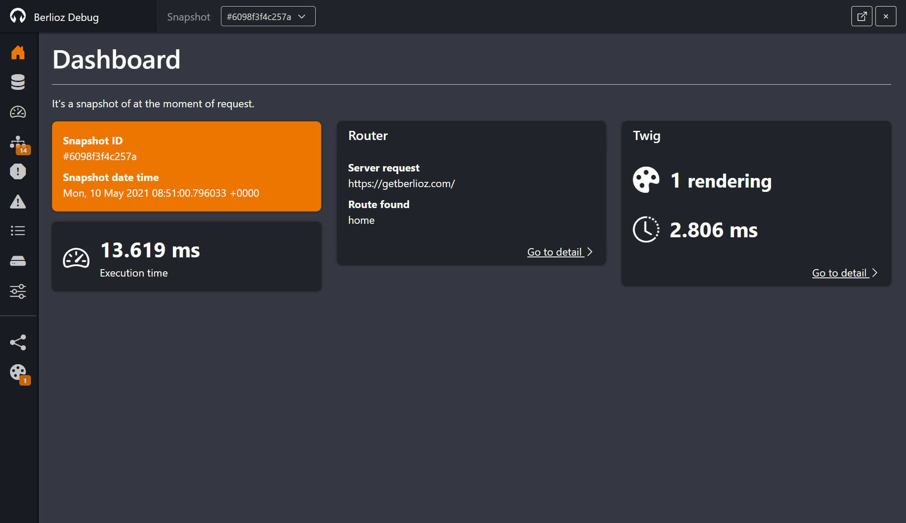

```index
breadcrumb: Getting started; Debug
```

# Debug

Berlioz provides a debug toolbar and console to facility your development.

## Toolbar

The toolbar shown at left bottom of your page, and indicate the time of page execution.


> If an error occurred during script execution, the check icon transform to cross icon ;)

Two icons appears on hover. The first to hide the toolbar, and the second to switch at right the toolbar (this action is saved into a cookie to reproduce the position).

## Console

To open console, you need to click on the toolbar.




## Enable/Disable debug mode

In your configuration file, you need to specify the activation of debug, by default, the debug mode is not enable.

```json
{
  "berlioz": {
    "debug": {
      "enable": true
    }
  }
}
```

## Restrict to an IP or host

By security, you can restrict the activation of debug mode to some ips or host.
In your configuration file, you need to declare the list of authorized ips and hosts, like this:

```json
{
  "berlioz": {
    "debug": {
      "enable": true,
      "ips": [
        "127.0.0.1",
        "getberlioz.com"
      ]
    }
  }
}
```

In this example, debug mode is activate only for local ip `127.0.0.1` and host `getberlioz.com`.