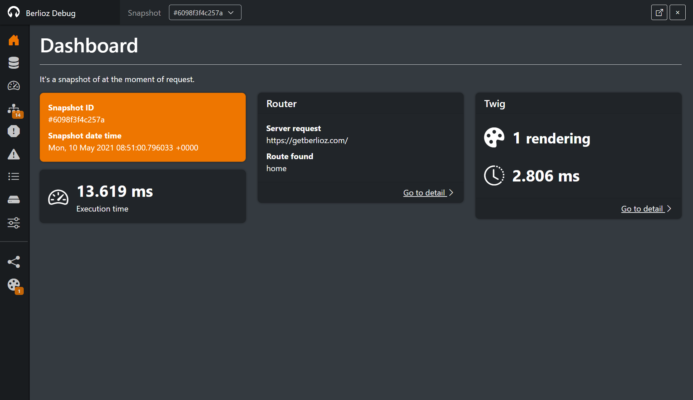

---
breadcrumb:
  - Getting started
  - Debug
---

# Debug

Berlioz provides a debug toolbar and console to facility your development.

## Toolbar

The toolbar shown at left bottom of your page, and indicate the time of page execution.


> **Info:** If an error occurred during script execution, the check icon transform to cross icon ;)

Two icons appears on hover. The first to hide the toolbar, and the second to switch at right the toolbar (this action is
saved into a cookie to reproduce the position).

## Console

To open console, you need to click on the toolbar.



## Enable/Disable debug mode

In your configuration file, you need to specify the activation of debug, by default, the debug mode is not enable.

```json
{
  "berlioz": {
    "debug": {
      "enable": true
    }
  }
}
```

## Restrict to an IP or host

By security, you can restrict the activation of debug mode to some ips or host.
In your configuration file, you need to declare the list of authorized ips and hosts, like this:

```json
{
  "berlioz": {
    "debug": {
      "enable": true,
      "ip": [
        "127.0.0.1",
        "getberlioz.com"
      ]
    }
  }
}
```

In this example, debug mode is activated only for local ip `127.0.0.1` and host `getberlioz.com`.

### Client IP resolution behind a proxy

> 🆕 **Info**: *Since version 3.2*
>
> The client IP checked against the allow-list is now taken from `REMOTE_ADDR` and the `X-Forwarded-For` header is
> **no longer trusted by default**. Previously, a spoofed `X-Forwarded-For` header could bypass the IP restriction and
> enable the debug mode from any origin.

If your application runs behind a trusted reverse proxy or load balancer, declare the proxy addresses (single IPs or
CIDR ranges) under `berlioz.proxies.trusted`. Only then is the forwarded client IP taken into account:

```json
{
  "berlioz": {
    "proxies": {
      "trusted": [
        "10.0.0.0/8",
        "192.168.1.10"
      ]
    },
    "debug": {
      "enable": true,
      "ip": [
        "127.0.0.1",
        "getberlioz.com"
      ]
    }
  }
}
```

When no trusted proxy is configured, the forwarded headers are ignored and `REMOTE_ADDR` is used as the client IP.

## Snapshot retention

> 🆕 **Info**: *Since version 3.2*

When debug mode is enabled, Berlioz records a snapshot (debug report) for each request. To prevent the debug directory
from growing indefinitely, old snapshots are garbage collected **probabilistically on write**, according to a
retention policy configured under `berlioz.debug.gc`:

```json
{
  "berlioz": {
    "debug": {
      "enable": true,
      "gc": {
        "probability": 1,
        "divisor": 100,
        "max_age": 7,
        "max_files": 100
      }
    }
  }
}
```

- **`probability`** / **`divisor`**: the garbage collector runs with a probability of `probability / divisor` on each
  snapshot write (default `1 / 100`, i.e. ~1% of requests). Set `probability` to `0` to disable automatic collection.
- **`max_age`**: delete snapshots older than this number of days (`null` to disable).
- **`max_files`**: keep at most this number of snapshots, deleting the oldest ones beyond the limit (`null` to
  disable).

You can also trigger the cleanup manually with the [`berlioz:debug-clear`](../cli.md#berliozdebug-clear) CLI command.
